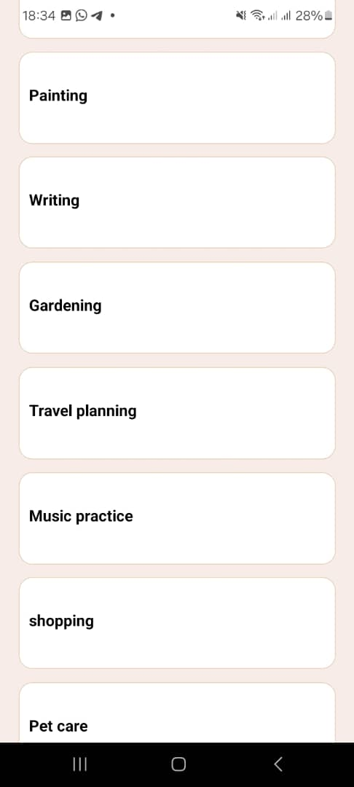

README: React Native Task Management App

This is a Task Management App  designed to help users organize and manage their tasks efficiently. It includes various features such as categorizing tasks into different categories, and displaying ongoing tasks.

# Components Usage:
# View:
Used for grouping and arranging other components.

# Text:
used for displaying text content.

# ScrollView:
Used for scrolling through lists of tasks if they exceed the screen height.

# TextInput:
Used for capturing user input, such as task names.

# Stylesheet:
Used for defining styles for components, including layout, colors, and typography.

# FlatList or SectionList:
Used for rendering lists of tasks in a scrollable format, allowing users to view and interact with each task individually.

# Image:
Used for displaying icons and images, enhancing the visual appeal of the app.

# Description:
This task management app allows users to organize their tasks efficiently by categorizing them into different categories such as Exercise, Study, Clean, Cook, etc. Users can create new tasks, view ongoing tasks, and manage them effectively.

# pictures

